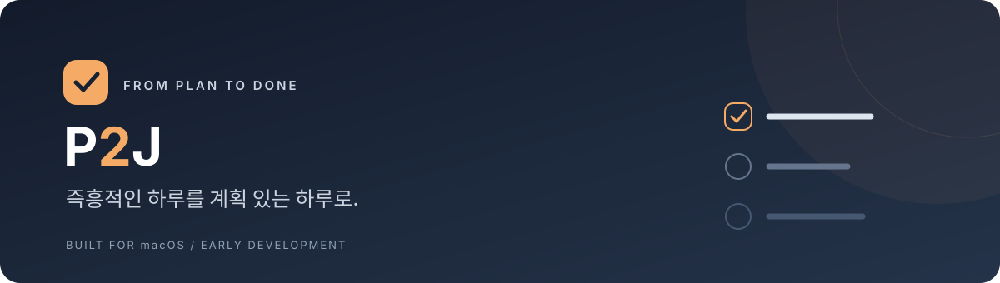
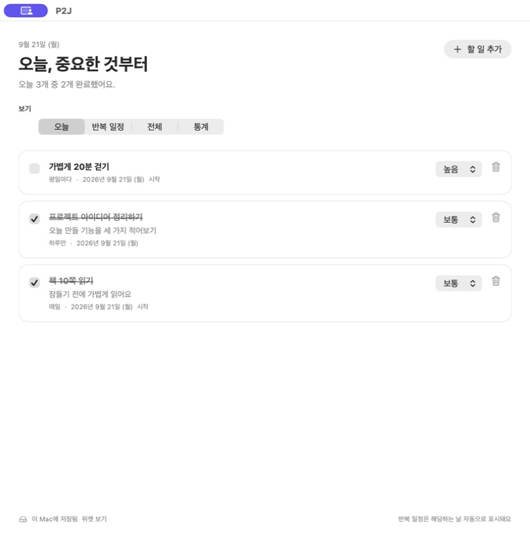
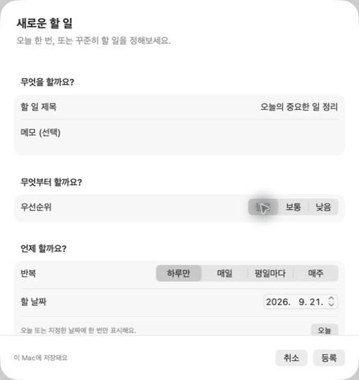
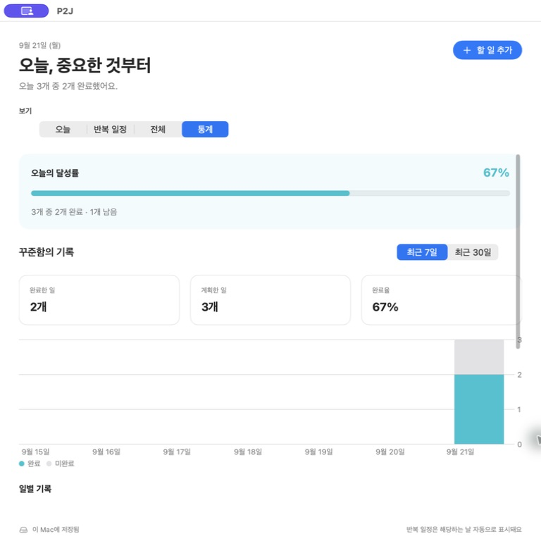
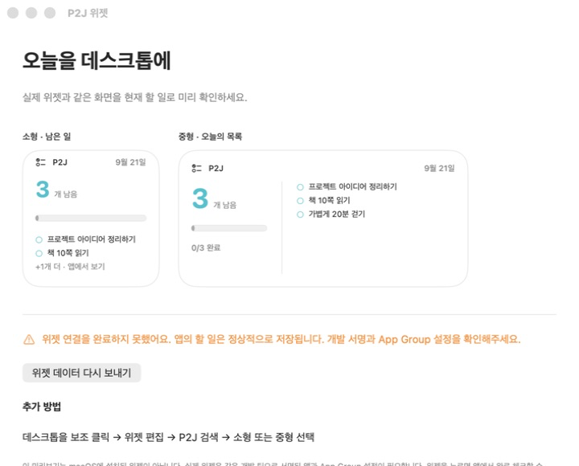

<p align="center">
  
</p>

<p align="center">
  <strong>할 일을 적고, 우선순위를 정하고, 오늘의 중요한 일에 집중하세요.</strong><br>
  앱에서도, 메뉴 막대에서도, macOS 위젯에서도.
</p>

<p align="center">
  <a href="#미리보기">미리보기</a> ·
  <a href="#시작하기">시작하기</a> ·
  <a href="#로드맵">로드맵</a> ·
  <a href="https://github.com/cg-1119/P2J/issues">피드백</a>
</p>

<p align="center">
  <code>macOS 14+</code> &nbsp; <code>Swift 6</code> &nbsp; <code>SwiftUI + WidgetKit</code> &nbsp; <code>개발 중</code>
</p>

> **아직 정식 출시 전입니다.** 앱에서 일회성·반복 할 일을 등록하고 로컬에 저장할 수 있습니다. 날짜별 완료 체크와 7일·30일 통계를 지원합니다. 소형·중형 위젯과 공유 데이터 연결을 구현했으며, 실제 데스크톱 등록은 개발 서명 후 확인해야 합니다. 높음·보통·낮음 우선순위와 메뉴 막대에서의 완료 체크를 지원합니다. 설치용 배포 파일은 아직 제공하지 않습니다.

## 오늘 무엇부터 할까요?

**P2J**는 MBTI의 P → J에서 착안한 이름입니다. 즉흥적인 하루에 작은 계획을 더하고, 하나씩 실행하도록 돕는 macOS TODO 앱입니다. 성격을 바꾸기보다 오늘의 할 일을 정리하고 끝내는 경험에 집중합니다.

| 사용 공간 | 목표하는 경험 | 현재 상태 |
| :--- | :--- | :--- |
| **앱** | 오늘 할 일을 정리하고 중요한 순서대로 확인 | 등록·삭제·날짜별 완료·통계 구현 |
| **메뉴 막대** | 작업 중에도 목록을 빠르게 열고 완료 체크 | 오늘 목록·완료 체크·우선순위 변경 구현 |
| **위젯** | 데스크톱에서 중요한 할 일과 진행 현황 확인 | 소형·중형 화면·공유 데이터 구현, 시스템 등록 검증 예정 |

## 미리보기

### 오늘의 화면

<p align="center">
  
</p>

<p align="center"><sub>2026-09-21 · 실제 앱에 예시 항목을 등록한 화면</sub></p>

### 할 일 등록

<p align="center">
  
</p>

두 이미지는 실제 앱에 예시 데이터를 입력해 캡처했습니다. 아래 위젯 이미지는 앱 내 미리보기이며 실제 데스크톱 위젯과 구분해 표시했습니다. 메뉴 막대에서도 같은 목록의 완료 체크와 우선순위를 변경할 수 있습니다.

## 할 일 등록하기

**할 일 추가** 또는 **⌘N**으로 등록 창을 열고 제목과 선택 사항인 메모, 우선순위를 입력합니다.

| 방식 | 표시되는 날 | 예시 |
| :--- | :--- | :--- |
| **하루만** | 선택한 날짜에 한 번. 기본값은 오늘 | 오늘 제출할 서류 |
| **매일** | 시작일부터 매일 | 책 10쪽 읽기 |
| **평일마다** | 시작일 이후 월~금, 공휴일 포함 | 출근 전 일정 확인 |
| **매주** | 시작일과 같은 요일마다 | 매주 월요일 회고 |

- **오늘**은 오늘 해당하는 일정만, **반복 일정**은 등록된 반복 항목을 보여줍니다.
- **전체**에서는 과거·미래를 포함한 모든 등록 항목을 확인합니다.
- 목록의 휴지통 버튼으로 삭제할 수 있습니다. 반복 항목은 해당 반복 일정 전체가 삭제됩니다.
- 데이터는 이 Mac에 저장되어 재실행 후에도 유지됩니다. 다른 기기와 동기화되지는 않습니다.

## 오늘 끝낸 일 체크하기

목록 왼쪽 체크박스로 **오늘 완료**를 표시하거나 취소하세요. 완료하면 제목에 취소선이 표시되고 상단 완료 수가 즉시 갱신됩니다. 오늘에 해당하지 않는 일정은 체크할 수 없습니다.

반복 일정의 완료 상태는 날짜별로 보관합니다. 오늘 체크해도 다음 반복일에는 다시 미완료로 표시됩니다. 알림 전송은 아직 지원하지 않습니다.

## 중요한 일부터

우선순위는 **높음 · 보통 · 낮음** 중에서 선택합니다. 기본값과 기존 항목은 **보통**입니다. 등록 창에서 지정하거나 앱 목록 오른쪽 선택 메뉴에서 바로 바꿀 수 있습니다.

앱과 메뉴 막대는 **미완료 → 높은 우선순위 → 등록 순서**로 정렬합니다. 위젯에도 높은 우선순위의 미완료 항목이 먼저 표시되고, 높은 항목에는 깃발 표시가 붙습니다. 반복 일정의 우선순위는 해당 일정 전체에 적용됩니다.

## 메뉴 막대에서 바로 체크

화면 상단의 **P2J**를 누르면 오늘의 목록과 완료 현황을 볼 수 있습니다.

- 체크박스로 완료 표시·취소
- 항목 오른쪽에서 우선순위 변경
- 긴 목록은 스크롤해서 확인
- **앱 열기**로 전체 목록과 통계 확인

앱과 메뉴 막대가 같은 저장소를 사용하므로 변경이 함께 반영됩니다. 앱 창을 닫아도 메뉴 막대는 유지되며, **종료**를 누르면 앱이 종료됩니다.

## 꾸준함을 통계로 보기

**보기 → 통계**에서 오늘의 달성률과 최근 **7일 / 30일** 기록을 확인하세요.

- 기간별 완료한 일·계획한 일·완료율
- 날짜별 완료/미완료 막대 차트와 일별 기록
- 삭제한 일정의 과거 기록 보존

<p align="center">
  
</p>

통계는 오늘을 포함하며, 하루에 할 일 하나를 1건으로 계산합니다. 반복 일정은 해당 날짜마다 1건입니다. 삭제일부터는 새 계획에 포함하지 않지만, 삭제 당일 이미 완료한 기록과 이전 기록은 유지합니다. 시작일을 과거로 등록하면 과거 계획 수에도 반영됩니다.

## 데스크톱에서 오늘 확인하기

- **소형**: 남은 일 수, 완료율, 미완료 항목 최대 2개
- **중형**: 남은 일 수, 완료 수, 미완료 항목 최대 3개
- 항목이 더 많으면 추가 개수를 표시하고, 모두 끝내면 완료 메시지를 표시합니다.
- 위젯을 누르면 앱이 열립니다. 완료 체크는 앱에서 합니다.
- 앱에서 변경하면 갱신을 요청하며, 자정 이후의 일정도 미리 준비합니다. 실제 갱신 시점은 macOS가 결정합니다.

<p align="center">
  
</p>

**위 이미지는 앱 내 미리보기입니다.** 앱 아래쪽 **위젯 보기** 또는 **윈도우 → 위젯 미리보기 및 연결**에서 현재 데이터로 확인할 수 있습니다. 위젯과 동일한 화면 코드를 사용하지만, macOS 데스크톱에 등록된 위젯을 캡처한 것은 아닙니다.

실제 설치에는 앱·위젯의 개발 서명과 App Group 연결이 필요합니다. [설정 및 검증 가이드](docs/WIDGETS.md)를 참고하세요.

## 시작하기

현재는 Xcode에서 소스를 빌드해 실행할 수 있습니다.

### 준비물

- **macOS 14.0 이상**
- **Xcode 16 이상**, Swift 6 지원 환경
- 위젯 등록과 실행 확인을 위한 개인 개발 서명 설정

로컬 빌드는 Xcode 26.5에서 확인했습니다. 외부 패키지나 프로젝트 생성 도구는 필요하지 않습니다.

### 소스에서 실행

```sh
git clone https://github.com/cg-1119/P2J.git
cd P2J
open P2J.xcodeproj
```

1. Xcode에서 **P2J** 스킴과 **My Mac**을 선택합니다.
2. 개발 서명을 설정합니다. 방법은 [개발 가이드](docs/DEVELOPMENT.md#개발-서명)를 참고하세요.
3. **⌘R**로 실행합니다. 앱 창과 메뉴 막대의 체크리스트 아이콘이 나타납니다.

서명된 앱을 실행한 뒤 macOS의 **위젯 편집**에서 **P2J**를 찾아 추가할 수 있습니다. 위젯의 시스템 등록과 실제 표시는 개발 서명 환경에서 별도 검증해야 합니다. 연결 설정은 [위젯 가이드](docs/WIDGETS.md)를 참고하세요.

<details>
<summary><strong>서명 없이 빌드만 확인하려면</strong></summary>

```sh
xcodebuild \
  -project P2J.xcodeproj \
  -scheme P2J \
  -configuration Debug \
  -destination 'generic/platform=macOS' \
  -derivedDataPath build \
  CODE_SIGNING_ALLOWED=NO \
  build
```

앱과 포함된 위젯의 컴파일·패키징을 확인하는 명령입니다. 배포용 서명이나 위젯 등록은 검증하지 않습니다.

</details>

## 로드맵

첫 버전은 **오늘의 목록을 만들고, 중요한 일부터 끝내는 흐름**에 집중합니다.

- [x] macOS 앱·메뉴 막대·위젯 프로젝트 구성
- [x] 할 일 모델과 로컬 저장
- [x] 일회성·매일·평일·매주 할 일 등록 및 삭제
- [x] 오늘·반복 일정·전체 목록
- [ ] 등록한 할 일 수정
- [x] 우선순위 설정 및 앱·메뉴 막대·위젯 공통 정렬
- [x] 날짜별 완료 체크와 오늘의 진행 현황
- [x] 최근 7일·30일 통계 및 일별 차트
- [x] 메뉴 막대에서 실제 목록 확인·완료 처리·우선순위 변경
- [x] App Groups를 통한 위젯용 데이터 전달
- [x] 소형·중형 위젯의 미완료 목록과 완료 현황
- [ ] 서명된 앱에서 데스크톱 위젯 등록·갱신 검증
- [x] 등록·목록의 실제 화면 및 소스 실행 안내
- [ ] 배포 파일 설치 안내
- [ ] 배포용 서명·공증 및 첫 릴리스

## 프로젝트 안쪽

**SwiftUI**로 앱을, **MenuBarExtra**로 빠른 보기를, **WidgetKit**으로 위젯을 구성합니다. 앱은 **App Groups**에 표시용 복사본을 저장하고 위젯은 이를 읽습니다. 원본 할 일 저장소는 그대로 유지합니다.

```text
TODOFirst/
├── App/                  앱 진입점
└── Features/
    ├── Today/            오늘의 할 일 화면
    ├── MenuBar/          메뉴 막대 빠른 보기
    └── Statistics/       완료 통계와 차트
TODOFirstWidgets/         WidgetKit 확장
Shared/Tasks/             일정 모델·로컬 저장·상태 관리
Tests/                    핵심 로직 테스트
Package.swift             핵심 로직 테스트용 Swift 패키지
Configuration/            공통 빌드 설정과 개인 서명 예시
docs/                     개발 안내와 실제 화면 이미지
P2J.xcodeproj/       Xcode 프로젝트와 공유 스킴
```

프로젝트 구성과 각 기능은 독립된 커밋으로 관리합니다. 실행·서명·검증 방법은 [개발 가이드](docs/DEVELOPMENT.md), 이미지 갱신 기준은 [스크린샷 안내](docs/SCREENSHOTS.md)에 정리되어 있습니다.

## 함께 다듬기

불편한 점이나 아이디어는 [Issues](https://github.com/cg-1119/P2J/issues)에 남겨주세요. 버그 제보에는 macOS 버전, 재현 단계, 기대한 동작을 함께 적어주시면 도움이 됩니다.

라이선스는 아직 정하지 않았습니다. 배포 전에 이용 및 재배포 조건을 명시할 예정입니다.

---

<p align="center"><strong>P2J</strong><br><sub>즉흥적인 하루를 계획 있는 하루로.</sub></p>
