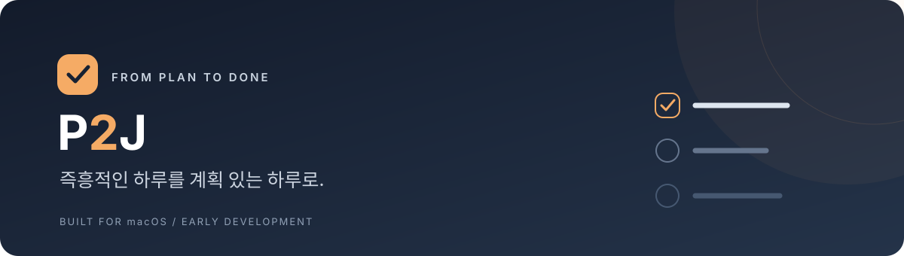
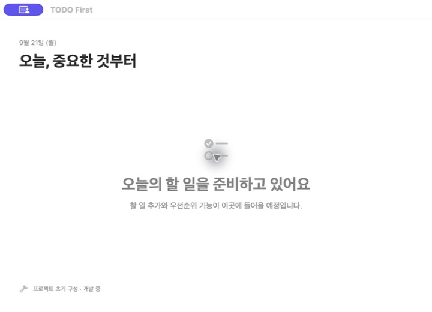
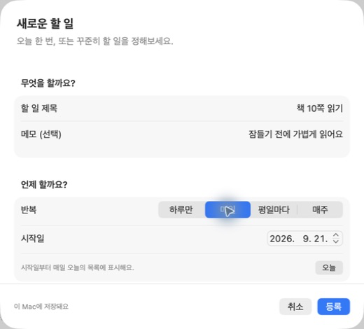
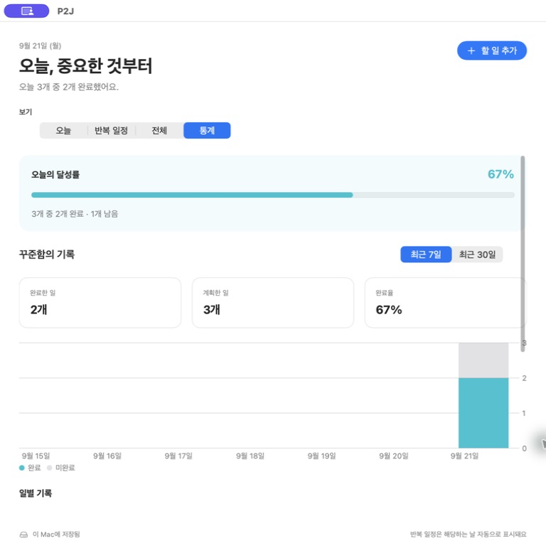
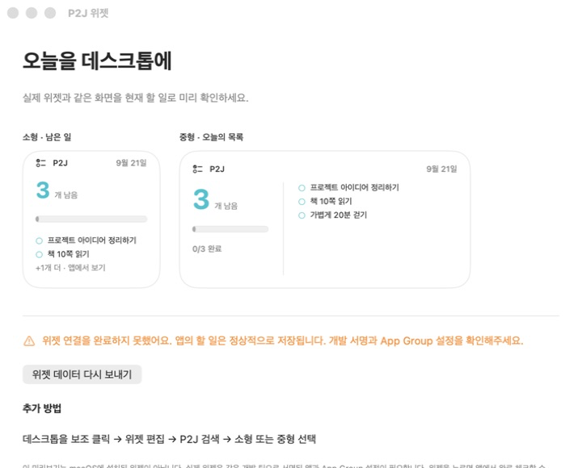

<p align="center">
  
</p>

<p align="center">
  <strong>오늘 할 일을 적고, 중요한 것부터 하나씩.</strong><br>
  하루의 계획과 꾸준한 습관을 함께 관리하는 Mac용 TODO 앱
</p>

<p align="center">
  <code>macOS 14+</code> &nbsp; <code>메뉴 막대</code> &nbsp; <code>오전 6시 하루 시작</code> &nbsp; <code>로컬 저장</code>
</p>

<p align="center">
  <a href="#시작하기">시작하기</a> ·
  <a href="#이렇게-사용하세요">사용 방법</a> ·
  <a href="#일반-모드와-상세-기록-모드">기록 모드</a> ·
  <a href="#codexclaude-code로-할-일-관리">AI 스킬</a> ·
  <a href="#자주-묻는-질문">자주 묻는 질문</a> ·
  <a href="https://github.com/cg-1119/P2J/issues">버그 제보</a>
</p>

## P에서 J로, 오늘부터

**P2J**는 MBTI의 **P → J**에서 이름을 가져왔습니다. 머릿속 계획을 할 일로 적고, 우선순위를 정하고, 하나씩 끝내는 데 집중합니다.

오늘만 할 일, 매일 이어갈 습관, 며칠에 걸친 작업을 한곳에서 관리하세요. 작업 중에는 메뉴 막대에서 빠르게 체크하고, 쌓인 기록은 통계로 돌아볼 수 있습니다.

> **현재는 개발 버전입니다.** 설치용 `.dmg`·`.app` 릴리스는 아직 없으며, Xcode에서 소스를 빌드해 실행할 수 있습니다. 데스크톱 위젯은 구현돼 있지만 실제 등록·갱신 검증은 아직 완료하지 않았습니다.

## 주요 기능

| 기능 | 사용 방법 |
| :--- | :--- |
| **오늘의 할 일** | 오늘 일정만 모아 보고 높음·보통·낮음으로 우선순위를 정합니다. |
| **반복 일정** | 매일·매주 할 일을 한 번 등록하고 날짜별로 완료합니다. |
| **기간 작업** | 시작일과 종료일을 정해 여러 날에 걸친 작업을 관리합니다. |
| **하위 TODO** | 큰 작업을 작은 단계로 나눠 개별 체크합니다. |
| **메뉴 막대** | 메인 창을 열지 않고 오늘의 일, 하위 TODO, 우선순위를 관리합니다. |
| **두 가지 기록 모드** | 간단한 완료 체크 또는 시작·종료 시각 기록을 선택합니다. |
| **통계** | 최근 7일·30일의 완료율과 수행 기록을 확인합니다. 상세 모드에서는 시간 기록도 봅니다. |
| **오전 6시 기준** | 자정이 지나도 새벽에 하던 일을 같은 하루로 이어갑니다. |

<details>
<summary><strong>앱 화면 미리보기</strong></summary>

아래는 예시 데이터로 실행한 **2026-09-21 버전의 실제 앱 캡처**입니다. 최신 등록 폼, 기간 작업·하위 TODO, 설정, 완료 포함 옵션은 반영되지 않았습니다. 이미지 출처와 커서 제거 보정 내역은 [캡처 정보](docs/SCREENSHOTS.md)에 기록했습니다.

<p align="center">
  
</p>
<p align="center">
  
</p>
<p align="center">
  
</p>

</details>

## 시작하기

현재 실행하려면 **macOS 14 이상**과 **Xcode 16 이상(Swift 6)**이 필요합니다. 빌드는 Xcode 26.5에서 확인했습니다.

```sh
git clone https://github.com/cg-1119/P2J.git
cd P2J
open P2J.xcodeproj
```

1. Xcode에서 **P2J** 스킴과 **My Mac**을 선택합니다.
2. [개발 서명 안내](docs/DEVELOPMENT.md#개발-서명)에 따라 본인의 개발 팀을 설정합니다.
3. **⌘R**로 빌드하고 실행합니다.
4. 첫 실행 튜토리얼에서 사용법과 기록 모드를 확인한 뒤 **할 일 추가**로 첫 작업을 등록합니다.

튜토리얼은 건너뛸 수 있으며 **설정 → 튜토리얼 다시 보기**에서 다시 열 수 있습니다. 설치 파일만 받아 실행하는 방식은 아직 제공하지 않습니다.

## 이렇게 사용하세요

### 1. 할 일을 등록하세요

**할 일 추가** 또는 **⌘N**을 누르고 제목과 일정을 입력하세요. 필요하면 메모, 우선순위, 하위 TODO를 추가합니다.

| 일정 | 이런 일에 사용하세요 | 동작 |
| :--- | :--- | :--- |
| **하루만** | 오늘 제출할 지원서 | 선택한 날짜에 표시합니다. |
| **매일** | 영어 공부, 운동 | 시작일부터 매일 새롭게 완료 체크합니다. |
| **매주** | 주간 회고 | 시작일과 같은 요일마다 표시합니다. |
| **기간 작업** | 이번 주에 끝낼 포트폴리오 | 시작일부터 종료일까지 표시하며 한 번 완료하면 끝납니다. |

날짜를 누르면 달력이 열립니다. 목록의 **연필 버튼**으로 제목·메모·일정·우선순위·하위 항목을 수정할 수 있습니다.

하위 TODO를 모두 체크해도 부모 작업은 자동으로 완료되지 않습니다. 부모 작업도 직접 완료하세요. 반복 작업의 하위 체크는 날짜별로, 기간 작업의 하위 체크는 작업이 이어지는 동안 유지됩니다.

### 2. 필요한 목록을 고르세요

- **오늘:** 오늘에 해당하는 작업과 오늘의 완료 현황을 봅니다.
- **반복 일정:** 매일·매주 이어갈 일정을 관리합니다.
- **전체:** 진행 중인 일과 앞으로 할 일을 봅니다. 완료한 하루·기간 작업은 기본적으로 숨깁니다.
- **통계:** 최근 수행 기록과 완료 흐름을 확인합니다.

**전체 → 완료 포함**을 켜면 끝낸 작업도 다시 볼 수 있습니다. 날짜가 지났지만 끝내지 못한 작업은 **기한 지남**으로 남습니다. 지난 작업을 오늘 다시 수행하려면 연필 버튼에서 날짜를 변경하세요.

미완료 작업이 먼저, 같은 완료 상태에서는 높은 우선순위가 먼저 표시됩니다. 반복 일정은 오늘 완료해도 전체 목록에서 사라지지 않습니다.

### 3. 메뉴 막대에서 빠르게 확인하세요

Mac 상단의 **P2J**를 누르면 오늘 목록이 열립니다. 일반 모드에서는 부모·하위 TODO를 체크하고 우선순위를 바꿀 수 있습니다. 상세 모드에서는 부모 작업의 **시작·종료**를 기록합니다. **앱 열기**를 누르면 메인 창으로 이동합니다.

메인 창을 닫아도 메뉴 막대에서 계속 사용할 수 있습니다. 완전히 종료하려면 **P2J 종료** 또는 **⌘Q**를 누르세요.

## 일반 모드와 상세 기록 모드

**P2J → 설정… (⌘,)** 또는 톱니바퀴 버튼에서 **상세 기록 모드**를 켜고 끕니다. 앱 전체에 적용되며, 다시 실행해도 선택을 유지합니다.

| | 일반 모드 | 상세 기록 모드 |
| :--- | :--- | :--- |
| 완료 방법 | 체크박스로 완료 | **시작 → 종료**를 직접 선택 |
| 시작·종료 시각 UI | 표시하지 않음 | 표시 및 수동 기록·수정 |
| 통계 | 완료율과 수행 횟수 | 완료 통계와 시간 기록 |

상세 모드에서는 시작하지 않은 작업을 바로 종료할 수 없습니다. 종료를 누르지 않으면 하루가 지나도 미완료로 남습니다. 반복 작업은 새 작업일에 다시 시작하며 이전 미종료 기록을 보존합니다. 기간 작업은 여러 날에 걸쳐 이어갑니다.

놓친 시각은 **시간 기록·수정**에서 보완할 수 있습니다. 소요 시간은 **휴식을 포함한 시작부터 종료까지의 경과 시간**입니다. 시작·종료가 모두 있는 기록만 시간 합계와 평균에 포함합니다. 모드를 바꿔도 기존 기록은 삭제하지 않습니다.

## 하루는 오전 6시에 바뀝니다

Mac의 현지 시각을 기준으로 **오전 6시부터 다음 날 오전 5시 59분까지**를 같은 작업일로 봅니다.

예를 들어 화요일 오전 2시에 월요일 할 일을 마치면 월요일 완료 기록으로 남습니다. 화요일 오전 6시가 되면 화요일 목록으로 바뀝니다. 이전 기록을 지우거나 미완료 작업을 자동 완료하지는 않습니다.

## 통계 읽는 방법

**통계**에서 최근 **7일 / 30일**을 선택하면 완료율, 완료한 날 수, 우선순위별 성과와 이전 동일 기간 대비 변화를 확인할 수 있습니다.

- **하루 작업:** 작업 한 개를 한 건으로 셉니다.
- **반복 일정:** 예정된 날짜마다 한 회로 셉니다. 매일 일주일이면 7회입니다.
- **기간 작업:** 조회 기간과 겹치는 작업을 한 건으로 셉니다. 조회 기간 전에 이미 완료한 작업은 제외합니다.

일별 차트는 하루 작업과 반복 수행을 보여주며 기간 작업은 제외합니다. 하위 TODO는 별도 작업 수로 집계하지 않습니다. 일정의 날짜·반복 방식을 수정하면 과거 계획 수도 새 일정에 따라 달라질 수 있습니다.

## 위젯

앱 아래의 **위젯 보기**에서 소형·중형 미리보기를 확인할 수 있습니다. 소형은 남은 일 최대 2개, 중형은 최대 3개를 우선순위 순으로 표시합니다.

<details>
<summary>앱 내 위젯 미리보기 화면</summary>

<p align="center">
  
</p>

2026-09-21 버전의 앱 내 미리보기입니다.

</details>

**실제 데스크톱 등록·갱신은 아직 검증되지 않았습니다.** 개발 서명과 App Group 설정이 필요하며, 설치 및 검증 절차는 [위젯 가이드](docs/WIDGETS.md)에 있습니다. 위젯 내 직접 완료 체크는 지원하지 않습니다.

## 자주 묻는 질문

### 계정이 필요한가요? 다른 Mac과 동기화되나요?

계정 없이 사용합니다. 할 일과 완료 기록은 이 Mac에 저장되며, 현재 기기 간 동기화와 알림 기능은 없습니다.

### GitHub가 공개면 내 할 일도 공개되나요?

아니요. 저장소에는 앱 소스와 가상 데이터로 작성한 테스트 코드가 올라갑니다. 앱을 사용하면서 등록한 할 일이 GitHub로 자동 업로드되지는 않습니다. 버그 제보에 화면이나 로그를 첨부할 때는 개인 내용이 담겼는지 확인해주세요.

### 완료한 일이 사라졌어요

전체 목록에서 숨겨진 것이라면 **완료 포함**을 켜세요. 오늘 목록은 오늘에 해당하는 일정만 표시합니다. 지난 완료 기록은 통계에 남습니다.

### 삭제하면 통계에서도 없어지나요?

삭제한 일정은 앞으로의 목록에서 제외하지만 과거 완료 기록은 통계에 남깁니다. 현재 삭제한 일정을 복원하는 UI는 없습니다.

### 문제가 생기면 어디에 알려야 하나요?

[GitHub Issues](https://github.com/cg-1119/P2J/issues)에 **macOS 버전, 앱 버전 또는 커밋, 재현 순서, 기대한 동작과 실제 동작**을 적어주세요. 특히 멈춤 문제는 메뉴 막대에서 열었는지, 어떤 버튼을 누른 직후인지 함께 알려주시면 도움이 됩니다.

## Codex·Claude Code로 할 일 관리

대화로 P2J에 할 일을 등록하거나 완료 기록을 확인할 수 있습니다. **P2J가 실행되는 같은 Mac의 로컬 Codex·Claude Code**에서 사용하는 스킬입니다. 웹 채팅만으로 연결하는 기능은 아닙니다.

저장소 루트에서 설치하세요. Python 3이 필요합니다.

```sh
python3 Tools/install-skill both
# Codex만: python3 Tools/install-skill codex
# Claude Code만: python3 Tools/install-skill claude
```

이미 설치했다면 `--replace`를 붙여 업데이트합니다. 기존 설치본은 백업합니다. 새 세션에서 다음처럼 요청해보세요.

**Codex**

```text
$p2j-control 매일 할 일로 영어 공부 20분을 등록해줘. 우선순위는 보통으로.
```

**Claude Code**

```text
/p2j-control 오늘 할 일을 보여주고, 영어 공부의 시작을 기록해줘.
```

두 도구에서 조회·등록·수정·하위 체크·시작·완료·시간 기록·통계를 사용할 수 있습니다. 저장소 안에서 작업하는 경우에는 프로젝트 스킬이 포함돼 있어 별도 개인 설치 없이도 발견할 수 있습니다.

스킬은 `SKILL.md`와 실제 실행 스크립트, 요청 규격, Codex용 UI 메타데이터로 구성됩니다. CLI가 저장 파일을 직접 수정하는 대신 앱을 통해 처리하며, 상세 모드의 시작·종료 규칙도 그대로 적용합니다. AI에 조회한 내용은 해당 AI 서비스에서 처리될 수 있습니다.

설치 위치, 연결 진단, 사용 예시와 지원 범위는 [Codex·Claude Code 사용 안내](docs/AI_TOOLS.md)를 참고하세요.

## 개발 및 테스트

앱은 SwiftUI와 AppKit, 메뉴 막대는 MenuBarExtra, 위젯은 WidgetKit으로 구현합니다. [테스트 소스](Tests)는 앱 타깃과 분리해 공개합니다.

```sh
swift test
python3 -m unittest discover -s Tests/ToolTests -v
```

- [개발 가이드](docs/DEVELOPMENT.md) — 빌드, 서명, 저장 구조와 테스트
- [위젯 가이드](docs/WIDGETS.md) — App Group 설정과 검증 상태
- [AI 도구 안내](docs/AI_TOOLS.md) · [스킬](Skills/p2j-control/SKILL.md)
- [캡처 정보](docs/SCREENSHOTS.md) — 이미지 출처와 버전

현재 별도의 라이선스는 지정하지 않았습니다. 사용·수정·재배포 권한을 부여하는 오픈소스 라이선스는 아직 제공하지 않습니다.
